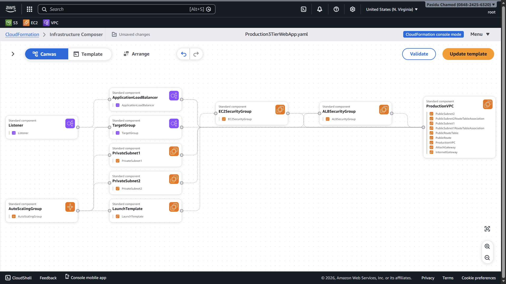
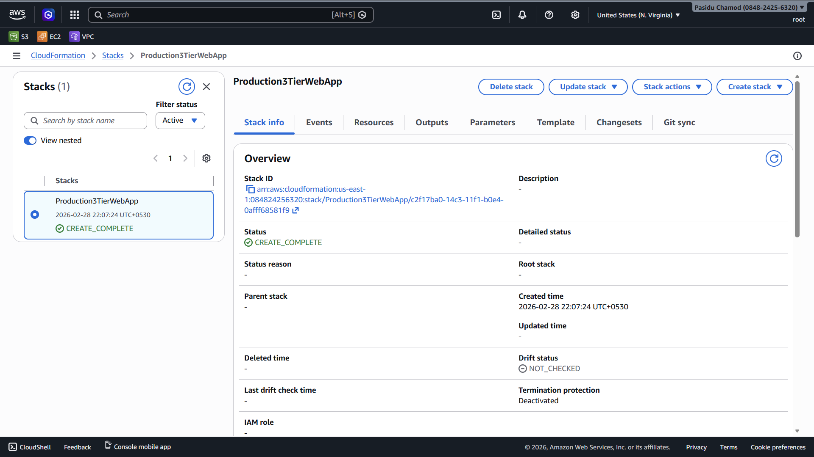

# Production Ready 3-Tier Architecture

This repository contains a single AWS CloudFormation template, `Production Ready 3-Tier Architecture.yml`, which provisions a highly available web tier backed by private compute resources. The stack is designed as a starting point for production workloads that need clear separation of presentation, application, and data tiers inside a dedicated VPC.

## Key Capabilities
- Isolated networking with a `/16` VPC, dual public subnets for ingress, and dual private subnets for workloads.
- Internet-facing Application Load Balancer with security group hardening and listener forwarding to the application tier.
- EC2 Auto Scaling Group using the latest Amazon Linux 2 AMI, Apache HTTP Server bootstrap, and multi-AZ placement across private subnets.
- Parameterized AMI selection through AWS Systems Manager Parameter Store for secure, automated OS updates.
- Outputs exposing the ALB DNS name for quick functional validation.

## Visuals
### Architecture Diagram


### CloudFormation Stack


### Template Preview


## Logical Architecture
```
Clients → Internet → ALB (public subnets) → Target Group → ASG instances (private subnets)
                                   │
                                   └─> VPC (10.0.0.0/16) with IGW and shared route table
```

| Tier | AWS Services | Purpose |
| ---- | ------------ | ------- |
| Presentation | Application Load Balancer, ALB security group, public subnets | Terminates HTTP traffic, provides health checks, and enforces public access rules. |
| Application | EC2 Auto Scaling Group, Launch Template, private subnets, EC2 security group | Runs the web application, scales between 1-2 instances, and stays unreachable from the internet. |
| Data (placeholder) | Private subnets, free CIDR capacity | Reserved network space for future RDS/ElastiCache layers; add NAT Gateways or endpoints as needed. |

## Template Parameters
| Name | Type | Default | Description |
| ---- | ---- | ------- | ----------- |
| `LatestAmiId` | `AWS::SSM::Parameter::Value<AWS::EC2::Image::Id>` | `/aws/service/ami-amazon-linux-latest/amzn2-ami-hvm-x86_64-gp2` | Pulls the latest Amazon Linux 2 AMI ID at stack launch. Override to pin a specific image. |

## Resource Inventory
| Logical ID | Resource | Notes |
| ---------- | -------- | ----- |
| `ProductionVPC` | VPC (`10.0.0.0/16`) | DNS support enabled. |
| `PublicSubnet1`, `PublicSubnet2` | Subnets | `/24` CIDRs with auto-assign public IPs for ALB. |
| `PrivateSubnet1`, `PrivateSubnet2` | Subnets | `/24` CIDRs for Auto Scaling Group instances. |
| `InternetGateway`, `AttachGateway` | IGW + attachment | Provides outbound connectivity for public subnets. |
| `PublicRouteTable`, `PublicRoute`, associations | Routing | Sends public subnet traffic to the IGW. |
| `ALBSecurityGroup`, `EC2SecurityGroup` | Security groups | Restricts public ingress to HTTP and app ingress to ALB source. |
| `ApplicationLoadBalancer`, `Listener`, `TargetGroup` | ALB stack | Internet-facing ALB with port 80 listener and instance target type. |
| `LaunchTemplate` | EC2 launch template | `t2.micro`, installs and starts Apache, serves placeholder page. |
| `AutoScalingGroup` | ASG | Spans private subnets, desired capacity 1 (min 1, max 2). |
| Output `LoadBalancerDNS` | Stack output | Provides ALB DNS for testing. |

## Deployment
1. **Prerequisites**
   - AWS CLI v2 configured with credentials and default region.
   - IAM permissions for CloudFormation, EC2, ELBv2, Auto Scaling, and VPC operations.

2. **Validate the template**
   ```bash
   aws cloudformation validate-template \
     --template-body file://"Production Ready 3-Tier Architecture.yml"
   ```

3. **Create or update the stack**
   ```bash
   STACK_NAME=prod-three-tier
   aws cloudformation deploy \
     --stack-name $STACK_NAME \
     --template-file "Production Ready 3-Tier Architecture.yml" \
     --capabilities CAPABILITY_NAMED_IAM
   ```
   *Remove `--capabilities` if you do not introduce IAM resources.*

4. **Retrieve the ALB endpoint**
   ```bash
   aws cloudformation describe-stacks \
     --stack-name $STACK_NAME \
     --query "Stacks[0].Outputs" --output table
   ```
   Browse to the `LoadBalancerDNS` URL to confirm the placeholder page loads.

## Post-Deployment Hardening
- Replace the Apache bootstrap with your application deployment pipeline (CodeDeploy, UserData, or SSM).
- Add NAT Gateways or VPC Endpoints for instances in private subnets to reach patch repositories securely.
- Extend the data tier with managed services (RDS Multi-AZ, Aurora, DynamoDB, or ElastiCache) inside the private subnets.
- Configure CloudWatch metrics/alarms, AWS WAF on the ALB, and AWS Backup plans for stateful tiers you add.

## Cost Awareness
- ALB, Auto Scaling EC2 instances, and two NAT Gateways (if added) dominate monthly spend.
- Default instance size `t2.micro` stays within AWS Free Tier when running a single instance, but production workloads typically require larger types.
- Consider consolidating NAT Gateways or using VPC endpoints to minimize hourly network costs.

## Operations Checklist
- **Patching**: Rotate AMI or bake a golden image pipeline to keep OS packages updated.
- **Resiliency tests**: Regularly force instance terminations to validate Auto Scaling recovery.
- **Scaling policy**: Attach target-tracking or step scaling policies once load metrics are known.
- **Observability**: Ship application logs to CloudWatch Logs or a centralized log service; enable ALB access logging to S3.

## Cleanup
To avoid charges, delete the CloudFormation stack when testing is complete:
```bash
aws cloudformation delete-stack --stack-name $STACK_NAME
```
Wait for the stack to reach `DELETE_COMPLETE` before exiting.
